## MCP

The MCP protocol is a common language that lets AI apps and external tools communicate smoothly. Just like a browser uses HTTP to talk to websites, the MCP protocol lets an AI—such as ChatGPT, VS Code, or your own web app—connect to small helper services (MCP servers) that provide capabilities like reading files, running queries, or calling APIs. It standardizes how the AI discovers these tools, sends requests, and receives results, making everything work together reliably and safely without custom integrations.

### MCP Server

An MCP server is like a plugin or helper service your AI can talk to. If you imagine ChatGPT as a “brain,” it can think and reason—but it can’t directly read your files, query your database, call your APIs, or update your systems. It needs “hands” to interact with the real world. MCP servers provide those hands by exposing safe, controlled tools the AI can use. For example, a File MCP can read or write files, a SQL MCP can run database queries, a GitHub MCP can create issues, and a custom MCP can do anything you code. Each server offers a specific set of capabilities, and the AI chooses which tools to use based on the task.

#### Core Components

| Component              | What It Is                                                             | Why It’s Core                                                  |
| ---------------------- | ---------------------------------------------------------------------- | -------------------------------------------------------------- |
| **Tools**              | Actions the AI can call                                                | Core for doing things                                          |
| **Resources**          | Data or files the client can access (read-only or read/write)          | Core for giving AI access to *state*                           |
| **Prompts**            | Server-provided prompt templates or structured instructions            | Core for giving AIs context-aware or workflow-specific prompts |
| **Capabilities**       | Metadata describing tools, resources, prompts, streaming, etc.         | Core handshake between client ↔ server                         |
| **Transport**          | WebSocket or stdio                                                     | Needed for communication                                       |
| **Protocol Handlers**  | Handles messages like `initialize`, `call_tool`, `read_resource`, etc. | Required for compliance                                        |
| **Execution Engine**   | Runs actual business logic                                             | Where server work happens                                      |
| **Security**           | Token validation, access rules                                         | Ensures safe execution                                         |
| **Logging & Errors**   | Standard notifications & errors                                        | Required for observability                                     |

As you can see its a complex protocol and there are lots of moving pieces that you need to know/care about. Imaging trying to implement that yourself for your MCP server. To get an idea, i asked chatgpt to do this for me and it generated this code

```python
import sys
import json
from typing import Any, Dict, Callable

# ---- 1. Define tools by hand ----
def add(a: int, b: int) -> int:
    return a + b

TOOLS: Dict[str, Callable[..., Any]] = {
    "add": add,
}

def list_tools():
    # Normally you'd return proper MCP tool schemas
    return [
        {
            "name": "add",
            "description": "Add two integers",
            "input_schema": {
                "type": "object",
                "properties": {
                    "a": {"type": "integer"},
                    "b": {"type": "integer"},
                },
                "required": ["a", "b"],
            },
        }
    ]

# ---- 2. Core MCP message loop over stdio ----
def handle_message(msg: Dict[str, Any]) -> Dict[str, Any]:
    method = msg.get("method")
    msg_id = msg.get("id")

    # Very simplified MCP-like behavior:
    if method == "initialize":
        return {
            "id": msg_id,
            "result": {
                "protocolVersion": "2024-11-01",
                "serverInfo": {"name": "demo-server", "version": "0.1"},
                "capabilities": {
                    "tools": True,
                    "resources": False,
                    "prompts": False,
                },
            },
        }

    if method == "tools/list":
        return {
            "id": msg_id,
            "result": {"tools": list_tools()},
        }

    if method == "tools/call":
        params = msg.get("params", {})
        name = params.get("name")
        args = params.get("arguments", {})

        if name not in TOOLS:
            return {
                "id": msg_id,
                "error": {
                    "code": 400,
                    "message": f"Unknown tool: {name}",
                },
            }

        try:
            result = TOOLS[name](**args)
            return {
                "id": msg_id,
                "result": {"content": result},
            }
        except Exception as e:
            return {
                "id": msg_id,
                "error": {
                    "code": 500,
                    "message": str(e),
                },
            }

    # Default: method not supported
    return {
        "id": msg_id,
        "error": {"code": 400, "message": f"Unsupported method: {method}"},
    }

def main():
    for line in sys.stdin:
        if not line.strip():
            continue
        msg = json.loads(line)
        response = handle_message(msg)
        sys.stdout.write(json.dumps(response) + "\n")
        sys.stdout.flush()

if __name__ == "__main__":
    main()
```

More importantly, though it did with this warning :)
> If you try to build an MCP server entirely by hand, you quickly become responsible for everything the protocol requires—handling all method names, message IDs, error codes, tool schemas, argument validation, resources, prompts, streaming, logs, session state, and authentication. It’s manageable for a tiny toy example, but as soon as you scale beyond a simple demo, the amount of protocol plumbing and edge-case handling becomes overwhelming and slows down real development.

Now compare above to using the FastMCP 2.0 tool


```python
from fastmcp import FastMCP
mcp = FastMCP("Demo Server")
@mcp.tool
def add(a: int, b: int) -> int:
    """Add two numbers"""
    return a + b
if __name__ == "__main__":
    # stdio or WebSocket/HTTP depending on how you run it
    mcp.run()
```


That's it - FastMCP handles all the gruntwork so no suprises, if you are starting out - start with FastMCP :)

####  Synthea MCP Server

```mermaid
  graph TD
    A[Server]
    subgraph B[MCP Resources]
        B1[data_dictionary: Data Dictionary of all the tables in the database.]
        B2[data://tables: List of available tables in the database.]
    end
    subgraph C[MCP Tools]
        C1[health_check: Health check for the Synthea MCP Server]
        C2[get_user_info: Get information about the authenticated user]
        C4[execute_sql_query: Execute a SQL query against the Synthea database]
    end
    A --> B
    A --> C
    D[🔒 Security]
    B -- Secured --> D
    C -- Secured --> D
```



#### Tracking MCP Server

```mermaid
  graph TD
    A[Air Quality Tracking MCP Server]
    subgraph B[MCP Resources]
        B1[tracking_data_dictionary: Data Dictionary for Air Quality Tracking datasets including CO, O3, PM2.5, and SO2 measurements.]
    end
    subgraph C[Tools]
        C1[get_air_quality_data: Load air quality data from CSV files and filter by specified parameters.]
        C2[list_available_datasets: List all available air quality datasets in the tracking directory.]
        C3[health_check: Health check for the Air Quality Tracking MCP Server.]
    end
    A --> B
    A --> C
    D[🔒 Security]
    B -- Secured --> D
    C -- Secured --> D
```



## Consumer

The client side flow is somewhat along this line


I am using the FastMCP client ([link](https://gofastmcp.com/clients/client)) as well so that i am less worried about the low level MCP protocol stuff. Things that i need to circle back to later are

#### Security for Multi-Servers : 
FastMCP supports these kind of configurations
```python
def get_mcp_config():
    return {
        "mcpServers": {
            "synthea": {
                "url": "https://xxxxx.net/mcp",
                "transport": "http",
            },
            "tracking": {
                "url": "https://yyyyyynet/mcp",
                "transport": "http",
            }
        }
    }
```
I was not able to get OAuth to work soely based on configuration. The only way i got it to work when the MCP server was secured with OAuth was handling it myself something like this

```python
server_name = "synthea" if response["name"] and response["name"].startswith("synthea") else "tracking"
    configs = get_mcp_config()
    server_url = configs["mcpServers"][server_name]["url"]

    async with Client(server_url, auth=BearerAuth(token=access_token)) as client:
        # Use the full resource URI directly
```
## Coming Up Next

In the next post, we'll look into ***Cost*** as an architectural concern in the context of an agent.
