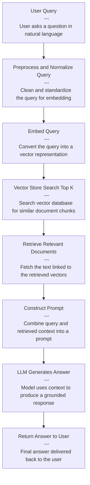

## Cost in RAG
When dealing with RAG only, for most cases, the flow is normally

Because the LLM gets context + user question and answers in one call, the cost (or tokens) are also more "deterministic" as show in the below figure ...i.e get nearest "n" searches from vector store and send that to the LLM to get the response.

If i switch to using agents, then things look different. Yes, i gain flexibility where my orchestrator is "dumb" initially (in RAG, your first step is always calling the vector store) but with the tools at its disposal, it can dynamically call/enlist methods that it needs to help answer - what data dictionaries exist, what tools can i call etc. But, this comes at the expense of more tokens/cost. For example, in the two screenshots, both calls for RAG are cheaper approximately 65% over equivalent calls using tools. 

With that said, there are definately optimizations that can be made to reduce costs - prompt optimizations, tool caching, token budgets, context pruning and others.

## Coming Up Next

In the next post, we'll look into ***Security*** as an architectural concern in the context of an agent.
