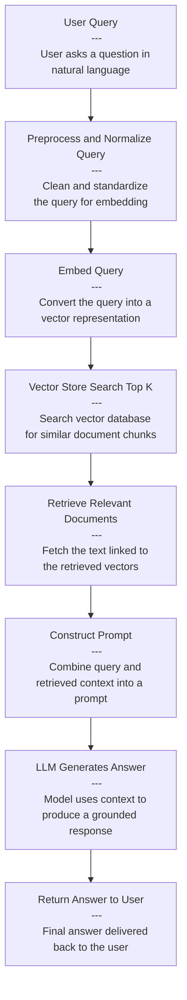

## Cost in RAG
When dealing with RAG only, for most cases, the flow is normally

Because the LLM gets context + user question and answers in one call, the cost (or tokens) are also more "deterministic" as show in the below figure ...i.e get nearest "n" searches from vector store and send that to the LLM to get the response.

If you switch to using agents, the flow changes. You gain flexibility—your orchestrator starts out “dumb” (unlike RAG, where the first step is always a vector store search), but with access to various tools, it can dynamically decide which methods to call to answer a query (like checking available data dictionaries or invoking specific tools). The tradeoff: increased token usage and cost. For example, in the screenshots, RAG calls are about 65% cheaper than equivalent agentic calls using tools. While token costs are dropping and may not be a deal breaker, if your agent orchestrates a long-running process, the main cost driver will likely be the compute time required to execute the query.

## Summary
The goal isn’t to discourage agentic AI, but to emphasize that your use case and expected ROI should drive the decision. Cost matters, but it shouldn’t dominate the conversation. What’s too expensive for one project may be perfectly reasonable for another if the ROI justifies it. And there are still many ways to optimize costs—prompt refinement, tool caching, token budgets, context pruning, and more

## Coming Up Next

In the next post, we'll explore ***Security*** as a critical architectural concern when building agentic AI systems.
